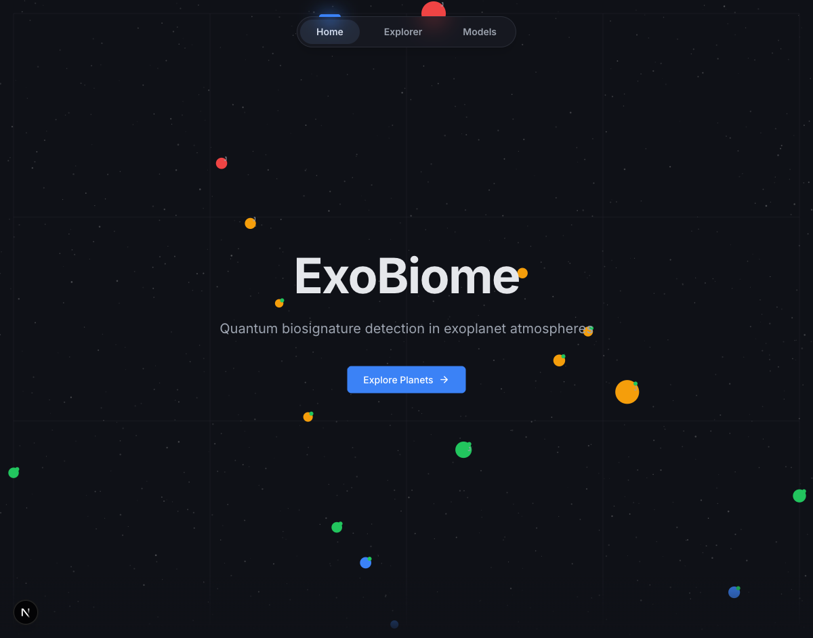
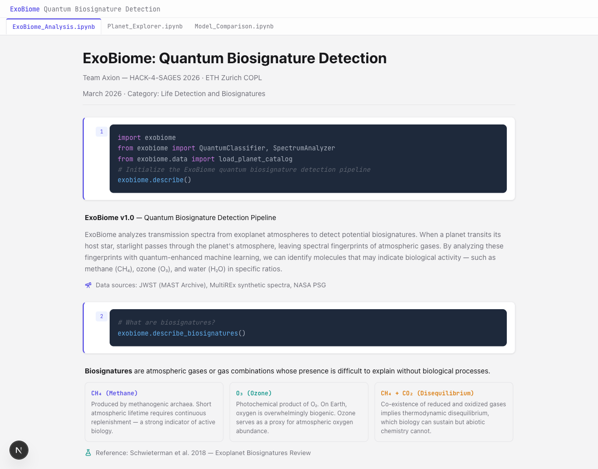

# ExoBiome — Web Frontend

Quantum biosignature detection web app. Built by **Axion** for HACK-4-SAGES 2026.

Two design variants:

- **`web/planet-field/`** — Interactive planet orbs in a dark star field, click to explore
- **`web/notebook/`** — Jupyter notebook aesthetic with code cells and output blocks

## Screenshots

### Planet Field



### Notebook



## Tech Stack

Next.js 16, React 19, Tailwind CSS v4, Framer Motion, Nivo, TypeScript

## Run locally

```bash
# Planet Field version
cd web/planet-field
npm install
npm run dev
# http://localhost:3000

# Notebook version (separate terminal)
cd web/notebook
npm install
npm run dev -- --port 3001
# http://localhost:3001
```

## Build

```bash
cd web/planet-field  # or web/notebook
npm run build
npm start
```

## Pages

- `/` — Landing page
- `/explorer` — Planet selection, spectrum chart, biosignature analysis
- `/models` — QELM Vetrano, QELM Extended, Classical RF comparison
