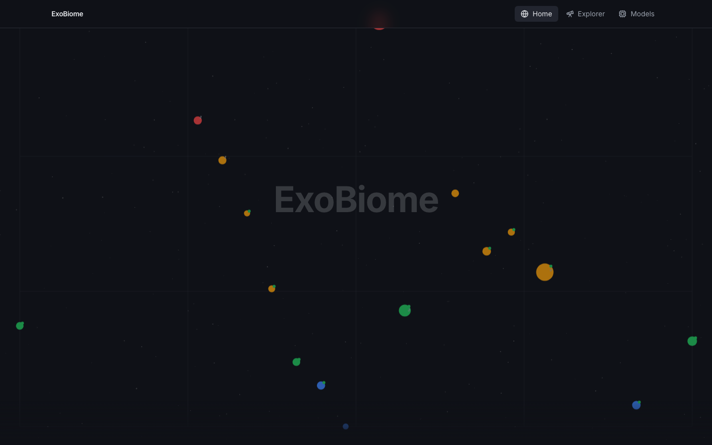
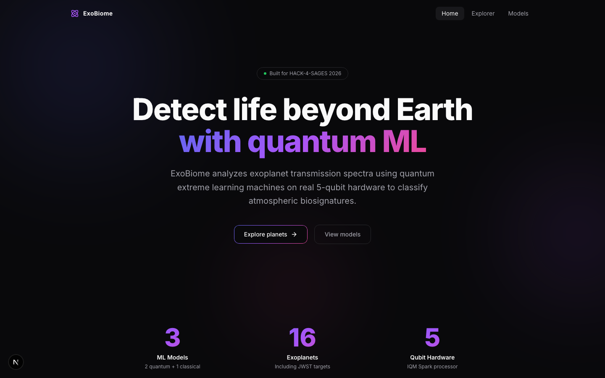

# ExoBiome — Web Frontend

Quantum biosignature detection web app. Built by **Axion** for HACK-4-SAGES 2026.

Two design variants:

- **`web/planet-map/`** — Interactive planet map with scatter-plot visualization
- **`web/startup-landing/`** — Modern startup landing page with gradient hero

## Screenshots

### Planet Map



### Startup Landing



## Tech Stack

Next.js 16, React 19, Tailwind CSS v4, Framer Motion, Nivo, TypeScript

## Run locally

```bash
# Planet Map version
cd web/planet-map
npm install
npm run dev
# http://localhost:3000

# Startup Landing version (separate terminal)
cd web/startup-landing
npm install
npm run dev -- --port 3001
# http://localhost:3001
```

## Build

```bash
cd web/planet-map  # or web/startup-landing
npm run build
npm start
```

## Pages

- `/` — Landing page
- `/explorer` — Planet selection, spectrum chart, biosignature analysis
- `/models` — QELM Vetrano, QELM Extended, Classical RF comparison
