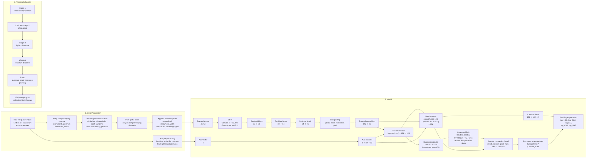

# Ariel Quantum Regressor Architecture

This document describes the model that is actually training now in `/Users/iwosmura/projects/hack4sages/models/ariel_quantum_regression/`.

## End-to-end view



## Prediction equation

The current model predicts:

```text
head_context = concat(fused, spectral_feat, aux_feat)
classical_pred = ClassicalHead(head_context)
quantum_angles = Projector(fused)
quantum_features = QuantumBlock(quantum_angles)
quantum_correction = QuantumHead(concat(head_context, quantum_features))
gate = tanh(quantum_gate[5])

final_pred = classical_pred + quantum_scale * gate * quantum_correction
```

That is different from the earlier version in two important ways:

1. The prediction head now gets direct skip-connected encoder summaries instead of relying only on the fused latent.
2. The quantum branch is a gated residual correction, not the main information bottleneck.
3. The gate is now per-target, so each gas can learn a different quantum residual strength.

## Current implementation details

- Spectral input channels are:
  - `instrument_spectrum`
  - `instrument_noise`
  - `instrument_width_template`
  - `wavelength_um`
- Only the first two channels vary by sample.
- The width and wavelength channels are fixed normalized templates shared across all samples.
- Auxiliary input has `8` features. `7` scale-like columns get `log10`; `star_temperature` stays linear.
- Targets are the `5` log-abundance values:
  - `log_H2O`
  - `log_CO2`
  - `log_CO`
  - `log_CH4`
  - `log_NH3`
- Splits are deterministic `80/10/10` train/validation/holdout.
- Primary stratification uses gas-presence signatures from `log_* >= -8.0`.
- Fallback stratification uses coarse abundance bins when signatures are too sparse.
- Loss is `MSE`; model selection is by validation RMSE mean in original target units.
- RMSE is computed once per epoch, not per batch.
- Training artifacts are saved incrementally:
  - `history.csv`
  - `training_state.json`
  - `best_model.pt`
  - `last_model.pt`
  - `validation_metrics.json`
  - `holdout_metrics.json`
  - `validation_predictions.csv`
  - `holdout_predictions.csv`
  - `testdata_predictions.csv`

## What changed from the stagnating version

- Added per-sample spectral normalization before train-split standardization.
- Stopped treating `instrument_width` as a learned sample-varying channel.
- Injected fixed `instrument_width` and wavelength templates explicitly.
- Replaced plain global averaging with mean pooling plus attention pooling.
- Added direct skip connections from `spectral_feat` and `aux_feat` into both prediction heads.
- Added `LayerNorm` in the quantum projector before `tanh(pi * x)`.
- Increased quantum initialization scale from the nearly-dead tiny-init regime.
- Switched to two-stage training instead of co-training everything from scratch.
- Added per-target quantum gates instead of one shared scalar gate.
- Split optimization into backbone, quantum-adapter, and quantum-circuit parameter groups.
- Disabled async `lightning.gpu` by default to avoid host-memory blowups on the laptop GPU run.
- Added gradual ramp and temporary backbone freezing during hybrid fine-tuning.
- Aligned training loss with the metric we care about by using `MSE` and selecting by RMSE.

## Latest verified run snapshot

As of `2026-03-11`, the best confirmed hybrid checkpoint is:

- Output root:
  - `/home/iwo/hack4sages-crossgen/outputs/ariel_quantum_stage2_restart_v4_20260311_185231`
- Best epoch:
  - `6`
- Best training-phase validation RMSE mean recorded during training:
  - `0.29081112146377563`
- Post-stop validation RMSE mean from re-evaluating `best_model.pt`:
  - `0.29361358284950256`
- Holdout RMSE mean from re-evaluating `best_model.pt`:
  - `0.2993761897087097`
- Behavior after epoch 6:
  - validation worsened after the backbone unfroze, so the epoch-6 checkpoint was kept and training was stopped

This stage-2 hybrid checkpoint is the best confirmed model at the moment this file was updated.
