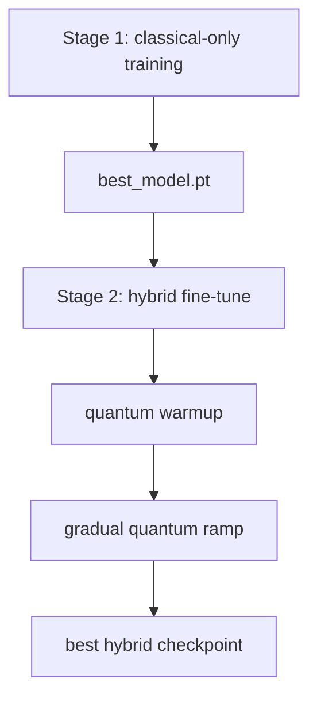

# Ariel Quantum Regressor Architecture

```mermaid
flowchart LR
    A["Raw spectra per planet<br/>52 bins x 4 raw arrays"] --> B["Preprocessing"]
    AUX["8 auxiliary features"] --> AUXP["log10 on scale-like cols<br/>train-split standardization"]

    B --> B1["Keep sample-varying channels<br/>spectrum, noise"]
    B --> B2["Inject fixed spectral metadata<br/>width template, wavelength"]
    B1 --> C["Model spectral tensor<br/>4 x 52"]
    B2 --> C

    C --> S0["Conv1d 4 -> 32, k=5<br/>GroupNorm + GELU"]
    S0 --> S1["Residual block 32 -> 32"]
    S1 --> S2["Residual block 32 -> 64"]
    S2 --> S3["Residual block 64 -> 96"]
    S3 --> SP["Dual pooling<br/>mean pool + attention pool"]
    SP --> SE["Spectral embedding 192 -> 96"]

    AUXP --> AE["Aux MLP 8 -> 32 -> 32"]

    SE --> F["Fusion MLP 128 -> 128"]
    AE --> F

    F --> CH["Classical head 128 -> 128 -> 5"]
    F --> QP["Quantum projector 128 -> 128 -> 8 angles"]
    QP --> QB["8-qubit variational block<br/>depth 2"]
    QB --> QH["Quantum correction head<br/>136 -> 128 -> 5"]

    CH --> OUT["Final 5-gas regression"]
    QH --> OUT

    G["tanh(quantum_gate) x quantum_scale"] --> OUT
```

## Current training flow

## What changed versus the stagnating version

1. The old run plateaued near the train-mean baseline because it treated `instrument_width` as a normal sample channel even though it is identical across planets.
2. The data pipeline now separates sample-varying channels from fixed spectral metadata and injects normalized `width` and `wavelength` templates explicitly.
3. The spectral encoder no longer ends with plain global averaging alone; it now uses attention-weighted pooling so a few informative bins can matter more than uninformative regions.
4. The objective now defaults to `MSE`, which is better aligned with the RMSE metric being optimized for model selection.
5. Training is now two-stage: first learn a strong classical backbone, then initialize the hybrid model from that checkpoint.
6. The quantum branch no longer turns on abruptly; it uses a warmup period plus a slow ramp so it does not destroy the classical solution as soon as it becomes active.
7. Progress saving is incremental during training via `history.csv`, `training_state.json`, `best_model.pt`, and `last_model.pt`.

## Observed effect

- Old hybrid run: validation RMSE was roughly flat around `1.45`.
- New stage 1 classical run: best validation RMSE reached about `0.6867`.
- New stage 2 hybrid run: best validation RMSE has already reached about `0.6636` while the quantum branch is still only partially ramped in.
