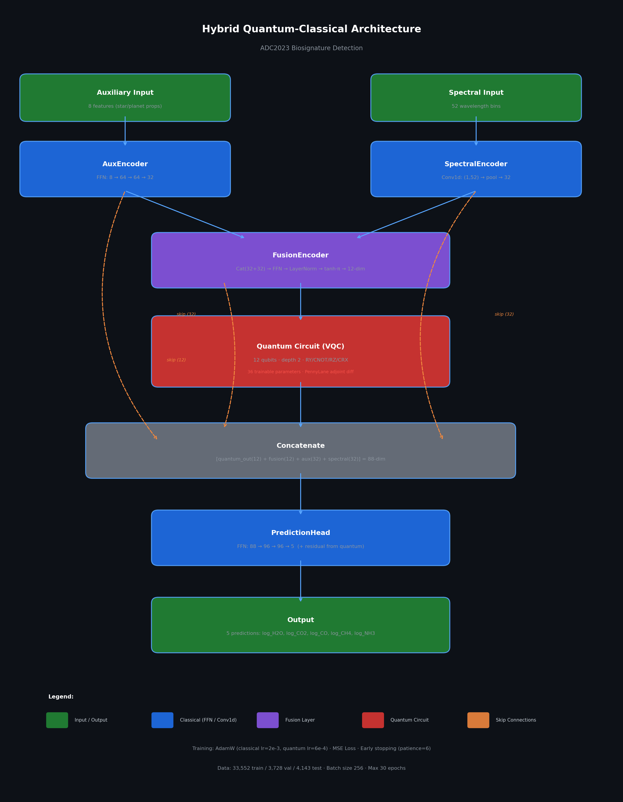

# Hybrid Quantum-Classical Model for Exoplanet Biosignature Detection

Variational quantum circuit (VQC) hybrid model that predicts atmospheric molecular abundances from exoplanet transmission spectra. Built for the HACK-4-SAGES hackathon (ETH Zurich, March 2026).

## Architecture



```
Aux (8 features) → AuxEncoder (FFN: 8→64→64→32) ──────────────────┐
                                                    ↓                │ skip
Spectra (52 bins) → SpectralEncoder (Conv1d→pool→32) ──────────────┐│
                                                    ↓               ││
                    FusionEncoder (cat→FFN→LayerNorm→tanh·π→12)     ││
                                                    ↓               ││
                    QuantumCircuit (12 qubits, depth 2, VQC)        ││
                                                    ↓               ││
                    Concatenate [quantum(12) + fusion(12) + spectral(32) + aux(32)] = 88
                                                    ↓
                    PredictionHead (FFN: 88→96→96→5) + residual from quantum
                                                    ↓
                    5 log₁₀ VMR predictions: H₂O, CO₂, CO, CH₄, NH₃
```

**Quantum specifics**: PennyLane VQC with `lightning.qubit` backend, adjoint differentiation. Ansatz: RY encoding → [RY, CNOT ring, RZ, CRX ring] × 1 → PauliZ measurements. 36 trainable quantum parameters.

## Results

Trained on ADC2023 dataset (41,423 samples), 30 epochs on CPU.

| Target | Test RMSE (log₁₀ VMR) |
|--------|----------------------|
| H₂O    | 0.635                |
| CO₂    | 0.521                |
| CO     | 0.543                |
| CH₄    | 0.440                |
| NH₃    | 0.571                |
| **Mean** | **0.542**           |

Training curves and per-target RMSE plots are in `outputs/model_quant_sketch_adc/`.

## Files

| File | Description |
|------|-------------|
| `crossgen_hybrid_training.py` | Full training pipeline (data loading, model classes, training loop, evaluation) |
| `hybrid_quantum_biosignature.ipynb` | Self-contained notebook with all model code inline |
| `model_architecture.png` | Architecture diagram |
| `model_improvement_report.md` | Report documenting the 8 fixes that made the model work |
| `research.md` | Original diagnosis of training failure root causes |
| `outputs/model_quant_sketch_adc/` | Trained weights, metrics, predictions, training curves |

## Quick Start

### Using the notebook

```bash
pip install torch pennylane pennylane-lightning pandas h5py scikit-learn matplotlib
jupyter notebook hybrid_quantum_biosignature.ipynb
```

### Using the Python module

```python
from crossgen_hybrid_training import TrainingConfig, run_training_experiment

result = run_training_experiment(TrainingConfig(qnn_qubits=12))
```

### Loading pretrained weights

```python
import torch
ckpt = torch.load("outputs/model_quant_sketch_adc/best_model.pt", map_location="cpu", weights_only=True)
model.load_state_dict(ckpt["model_state_dict"])
```

## Dataset

Expects the ADC2023 (Ariel Data Challenge) dataset at `ariel-ml-dataset/`:
- `TrainingData/AuxillaryTable.csv` — 8 stellar/planetary properties
- `TrainingData/Ground Truth Package/FM_Parameter_Table.csv` — 5 log₁₀ VMR targets
- `TrainingData/SpectralData.hdf5` — 52-bin transmission spectra per planet

Data is **not included** in this repo (too large). Download from [ariel-datachallenge.space](https://ariel-datachallenge.space).

## Key Design Decisions

- **Per-sample spectral normalization**: divides each spectrum by its own mean before global standardization, removing the Rp/Rs baseline to expose molecular absorption features
- **Skip connections**: encoder outputs bypass the quantum bottleneck directly to the prediction head
- **Separate optimizer groups**: classical params at lr=2e-3, quantum params at lr=6e-4
- **Quantum weight init at 0.5·randn**: avoids near-identity circuit and vanishing gradients
- **LayerNorm before tanh·π**: prevents FusionEncoder saturation

See `model_improvement_report.md` for the full story of what was broken and how it was fixed.
